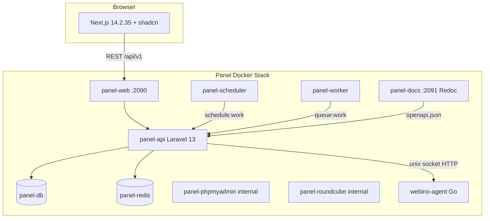
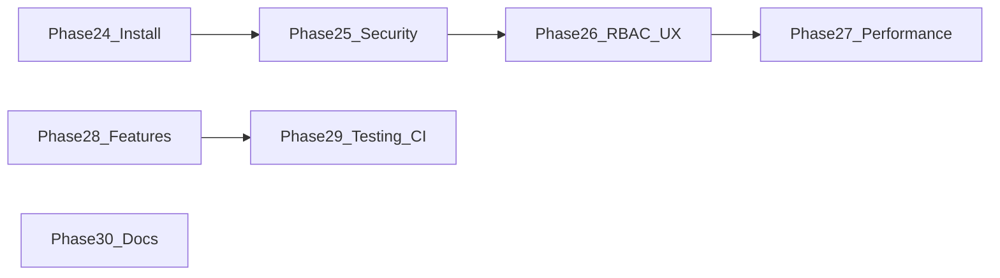

# WebinoServer Panel — Project Status

Last updated: 2026-07-26 (aaPanel parity SSOT Wave 0)

This document is the single source of truth for architecture, implementation status, known gaps, and planned phases of the WebinoServer hosting control panel.

**aaPanel parity (C+R):** capability gap matrix and waves 0–12 live in [AAPANEL_PARITY.md](AAPANEL_PARITY.md). Waves **1–3 Have** (Website hub, dual-stack, Softstore). Reseller hierarchy remains won't-fix.

**Important:** Module `index` endpoints list resources from the **panel MariaDB** by default. Provisioning (create/delete) calls the agent. A scheduled `panel:reconcile-host` job (every 15 minutes) compares panel rows with agent GET list endpoints and flags drift — see [Fixed in Phase 9](#fixed-in-phase-9) and [Fixed in Phase 12 & 13](#fixed-in-phase-12--13).

---

## Architecture



### Agent (`panel/agent`)

Go daemon (`webino-agent`) listening on a Unix socket. Endpoints include domains, databases, DNS, SSL, FTP, PHP, mail, files, cron, backups, system info (structured metrics), git, wordpress, and WebSocket PTY terminal.

### Docker (`panel/docker-compose.panel.yml`)

| Service | Role |
|---------|------|
| `panel-db` | MariaDB for panel metadata |
| `panel-redis` | Cache / queues |
| `panel-api` | Laravel API (entrypoint migrates/seeds) |
| `panel-scheduler` | `php artisan schedule:work` (metrics + backup schedules) |
| `panel-worker` | `php artisan queue:work` (async backups) |
| `panel-web` | Next.js SSR + API/embed proxies |
| `panel-docs` | Docusaurus + live Redoc OpenAPI |
| `panel-phpmyadmin` | Internal phpMyAdmin (signon + ticket) |
| `panel-phppgadmin` | Internal phpPgAdmin (signon + ticket) |
| `panel-roundcube` | Internal Roundcube webmail (autologon plugin) |
| `panel-agent` | Go agent (host socket, git, wp-cli) |

---

## Module implementation matrix

| Module | Backend | Frontend UI | Agent / host | Status | Gaps |
|--------|---------|-------------|--------------|--------|------|
| **Core** (Auth, 2FA, Navigation, Setup, Dashboard, password recovery, API tokens, profile) | ✅ | ✅ | — | **Implemented** | `auth/gate` middleware; shared `route_permissions.php`; read-open GET + `RequireRouteWrite` on mutations |
| **Security** (firewall, fail2ban, SSH, ClamAV, WAF, audit) | ✅ | ✅ | ✅ ufw/fail2ban/etc. | **Implemented** | WAF; UFW; fail2ban filters (incl. delete); ClamAV history+schedule; `security-*` nav icons; `IpAllowlistMiddleware` |
| **Users** (multi-user + roles) | ✅ | ✅ | — | **Implemented** | Spatie RBAC; Role CRUD + permission matrix; user edit; `RequireRouteWrite`; `users.manage` |
| **Metrics** (history + alerts) | ✅ | ✅ | ✅ structured `/v1/system/info` | **Partial** | Multi-channel alerts via `NotificationDispatcher`; live `current` when sample stale (>5 min) |
| **Websites** (hosting hub) | ✅ | ✅ | ✅ nginx vhost + composer/logs | **Implemented** | Wave 1 aaPanel parity: orchestrated create (pool/FTP/DB/SSL), rewrite/deny/hotlink/traffic, htpasswd, per-site logs; nav `/websites` |
| **Domains** | ✅ | ✅ | ✅ | **Implemented** | Aliases create/PATCH; hosting quota; agent registry drift UI; reconcile; create/delete |
| **Subdomains** | ✅ | ✅ | ✅ nginx vhost | **Implemented** | PHP pool + SSL/HTTPS/HSTS + PATCH edit; hosting quota; reconcile via `/v1/vhosts` |
| **Webserver** | ✅ | ✅ | ✅ nginx + Apache | **Have** (Wave 2) | dual-stack `engine`, HTTP/3 nginx; raw editor/redirects/proxy; see [AAPANEL_PARITY.md](AAPANEL_PARITY.md) |
| **Databases** | ✅ | ✅ | ✅ MySQL + PostgreSQL | **Implemented** | User CRUD, import/export, phpPgAdmin embed, remote IP UI; quota when `hosting_account_id` set |
| **Hosting** | ✅ plans + accounts | ✅ | ✅ provision/suspend/usage | **Implemented** | Plans (incl. `max_apps`), accounts with OS provision/deprovision, quota, bandwidth metering, quota alerts; **reseller won't-fix** |
| **Apps** (Docker containers) | ✅ | ✅ | ✅ docker.sock | **Have** (Wave 4) | Containers/images + Compose/networks/volumes/registry/daemon + Softstore docker one-click |
| **Monitoring** (services, logs, uptime, channels) | ✅ | ✅ | ✅ systemctl/journalctl | **Partial** | Service control, log tail, HTTP/TCP uptime, Telegram/Slack/webhook/email; hosting quota breach alerts |
| **Webhooks** (domain events, signed delivery) | ✅ | ✅ | — | **Implemented** | `backup.completed`, `ssl.expiring`, `alert.fired`, `user.created` |
| **Automation** (API tokens, CLI, SDKs) | ✅ | ✅ | — | **Implemented** | Scoped Sanctum tokens; `wpanel` CLI with 2FA + write commands; TS/Python SDKs; OpenAPI export in CI |
| **Platform / Sites** | ✅ | ✅ | ✅ via webina | **Implemented** | List/create/delete UI + `DELETE /api/v1/sites/{slug}` |
| **Products** | ✅ | ✅ | ✅ via webina | **Implemented** | Webino platform products, not hosting plans |
| **Dns** | ✅ | ✅ | ✅ list + CRUD | **Partial** | DNSSEC, slave zones, templates, import/export, PATCH records; reconcile record counts |
| **Ssl** | ✅ | ✅ | ✅ renew/wildcard/custom | **Partial** | Auto-renew + expiry alerts; DNS-01 wildcard via pdnsutil hooks; custom upload + chain validation; panel/mail bind |
| **Ftp** | ✅ | ✅ | ✅ list + provision | **Partial** | useradd + pure-pw passwd fixed; index panel DB; reconcile job |
| **Php** | ✅ | ✅ | ✅ settings in conf | **Implemented** | Pools + php.ini + extensions tabs; agent path jail |
| **Email** | ✅ | ✅ | ✅ Rspamd/Dovecot | **Partial** | SPF/DKIM/DMARC + queue + autoresponders; no mailing list UI polish |
| **Files** | ✅ | ✅ | ✅ live list | **Implemented** | Jailed to `WEBINO_FILES_ROOT` |
| **Cron** | ✅ | ✅ | ✅ per-user crontab | **Implemented** | `crontab -u USER`; hosting account selector; reconcile per-user |
| **Backup** | ✅ schedules + targets | ✅ | ✅ restic + restore | **Partial** | Restore/verify jobs; offsite targets (S3/SFTP/REST); restic incremental + retention prune |
| **System** | ✅ | ✅ | ✅ live | **Implemented** | — |
| **Terminal** | ✅ | ✅ xterm.js | ✅ WS + PTY | **Partial** | CheckOrigin allowlist (not open-by-default) |
| **Git** | ✅ | ✅ | ✅ | **Partial** | Index panel DB; reconcile drift via `panel:reconcile-host` (27.4) |
| **Wordpress** | ✅ | ✅ | ✅ wp-cli | **Partial** | Index panel DB; reconcile drift via `panel:reconcile-host` (27.4) |
| **Support** | ✅ | ✅ | DB-only | **Implemented** | No external desk/email integration (by design) |
| **phpMyAdmin** | ✅ embed tickets | ✅ iframe | internal Docker | **Implemented** | — |
| **phpPgAdmin** | ✅ embed tickets | ✅ iframe | internal Docker | **Implemented** | — |
| **Webmail** | ✅ embed tickets | ✅ iframe | internal Roundcube | **Implemented** | — |
| **API docs** | ✅ OpenAPI JSON | — | Docusaurus Redoc | **Implemented** | Full path export (`panel:export-openapi`); CI drift check; `:2091` dev profile only |

**Legend:** ✅ working · 🔶 stub or broken on host · **Partial** = usable but incomplete vs standard panels

---

## Known gaps, incomplete features & bugs

### Listing vs live host sync

| Resource | List/index source | Live host sync? |
|----------|-------------------|-----------------|
| Databases | Panel DB (`hosting_databases`) | Reconcile via agent `GET /v1/databases` |
| DNS zones/records | Panel DB | Reconcile via agent `GET /v1/dns/zones` + record count via `GET /v1/dns/records` |
| SSL certificates | Panel DB | Reconcile via agent `GET /v1/ssl/certificates` |
| FTP accounts | Panel DB | Reconcile via agent `GET /v1/ftp/accounts` |
| Mail accounts/forwarders/domains | Panel DB | Reconcile via agent `GET /v1/mail/accounts` |
| Cron jobs | Panel DB | Reconcile via agent `GET /v1/cron` |
| Backups | Panel DB | Reconcile via agent `GET /v1/backups` |
| Git / WordPress | Panel DB | No |
| Subdomains | Panel DB | Reconcile via agent `GET /v1/vhosts` |
| Docker apps | Panel DB (`docker_apps`) + agent container list merge | Live status via agent `GET /v1/docker/containers` |
| Files | Agent `POST /v1/files` action `list` | **Yes — live** |
| System info | Agent `GET /v1/system/info` | **Yes — live** |
| Domains | Panel DB + agent registry on index | Hybrid |
| Sites (platform) | `webina site list` | **Yes — live** (when webina works) |
| Support tickets | Panel DB only | **No external integration** |

### Fixed in Phase 9

| Area | Fix |
|------|-----|
| Dashboard | `sites` KPI from agent `/v1/domains` registry count |
| Databases | Agent `GET /v1/databases` lists MySQL DBs; destroy drops MySQL user; delete UI |
| SSL | Real `certbot revoke` + openssl expiry parse |
| FTP | `useradd` + `pure-pw passwd` with password |
| PHP | `settings` JSON written to FPM pool conf; settings editor in UI |
| Mail | `quota_mb` via `doveadm quota set`; mail-domains page |
| Metrics | Live `current` when sample older than 5 minutes |
| RBAC | `*.manage` on mutations; sensitive GETs (audit log, logs, channels, files) require matching permission |
| Reconcile | `panel:reconcile-host` every 15 min flags drift |
| Agent lists | GET handlers for DNS, SSL, FTP, mail, cron, backups |

### Fixed in Phase 12 & 13

| Area | Fix |
|------|-----|
| DNS | PATCH record updates via agent; DNSSEC enable/disable; slave zones; BIND import/export; zone templates; live record list |
| DNS reconcile | `panel:reconcile-host` compares per-zone record counts from agent |
| DNS UI | Typed record forms, edit-in-place, PTR helper, DNSSEC panel, template picker |
| Nginx vhosts | New `handlers_vhost.go` + `Modules/Webserver/` — list, raw editor, redirects, proxy, htpasswd, SSL/HSTS |
| Subdomains | `buildNginxVhost` with PHP-FPM `fastcgi_pass`, SSL, force HTTPS, HSTS; hotlink protection in template |
| Agent DNS | `handlers_dns.go` replaces basic zone/record handlers on `/v1/dns/*` |

### Fixed in Phase 14 & 15

| Area | Fix |
|------|-----|
| SSL | `panel:renew-ssl` daily auto-renew; `panel:check-ssl-expiry` expiry email alerts |
| SSL | Wildcard DNS-01 via certbot manual hooks + `pdnsutil` TXT (`handlers_ssl.go`) |
| SSL | Custom cert upload with `openssl verify` chain validation before install |
| SSL | Panel/mail service cert binding; reconcile syncs `expires_at`/`issuer` from agent |
| SSL UI | Renew, wildcard issue, custom upload + chain preview, auto-renew/alert toggles, bind selector |
| Backup | Restore flow (`RestoreBackupJob` + agent `restore` action) |
| Backup | Verify flow (`VerifyBackupJob` — sha256 + `restic check`) |
| Backup | Offsite targets CRUD (`backup_targets`); restic S3/SFTP/REST via `UploadOffsiteJob` |
| Backup | Schedule `target_id` + `mode` (full/incremental); retention restic forget/prune |
| Backup UI | Restore/verify buttons, offsite targets card, schedule target/mode selectors |

### Fixed in Phase 16 & 17

| Area | Fix |
|------|-----|
| Hosting | New `Modules/Hosting/` — `hosting_plans`, `hosting_accounts`, `hosting.manage` permission |
| Hosting | Suspend/unsuspend via agent (`handlers_hosting.go` — nginx symlink, FTP, cron) |
| Hosting | `HostingQuota` service + `hosting_account_id` FK on quota-bearing tables |
| Hosting | `panel:collect-hosting-usage` hourly; usage bars on `HostingAccountsPage` |
| Databases | MySQL user CRUD (grant/revoke/passwd) via `/v1/databases/users` |
| Databases | PostgreSQL create/drop/list via agent (`engine: pgsql`) |
| Databases | Import/export (`mysqldump`/`pg_dump`); per-DB size in index + agent sync |
| Databases UI | Engine selector, users section, export/import on `DatabasesPage` |

### Fixed in Phase 18 & 19

| Area | Fix |
|------|-----|
| Apps | New `Modules/Apps/` — `docker_apps` table, `AppController` + `ImageController`, `apps.manage` permission |
| Apps | Agent `handlers_docker.go` — container run/start/stop/restart/remove/logs, image list/pull/remove via `docker.sock` |
| Apps | Optional nginx reverse-proxy vhost on create (`proxy_domain` + `proxy_port`); `HostingQuota` `apps` resource |
| Apps UI | `AppsPage` — create form, container actions, logs sheet, images card |
| Monitoring | New `Modules/Monitoring/` — services, logs, uptime checks, notification channels |
| Monitoring | Agent `handlers_services.go` + `handlers_logs.go` — allowlisted systemctl + journalctl/tail |
| Monitoring | `NotificationDispatcher` — Telegram, Slack, webhook, email; metric alerts wired via `CollectMetricsCommand` |
| Monitoring | `panel:check-uptime` every minute; HTTP/TCP probes + down-transition notifications |
| Monitoring UI | `ServicesPage`, `LogsPage`, `UptimePage`, `NotificationChannelsPage` under `/monitoring/*` |

### Core / Dashboard / Auth

Phase 22–23 delivered cookie-only auth, 2FA login OTP/recovery, `/forbidden` UX, and frontend `routePermissions`. **Phase 26** aligned nav, route guards, and mutation UI (`RequireRouteWrite`); gated `GET /auth/tokens`; combined `auth/gate` middleware; fail-closed setup when API is down; i18n on forbidden/error pages.

### Agent stubs and bugs (`panel/agent`)

| File | Issue | Phase |
|------|--------|-------|
| `handlers_phase23.go` (cron) | ~~Uses agent process user's crontab~~ | **Fixed 28.1** — per-user `crontab -u` |
| `handlers_phase23.go` (`safeFilePath`) | Symlink jail escape — no `EvalSymlinks` | ~~25.6~~ **Fixed** |
| `security_validation.go` (cron) | `curl`/`wget` allowed in cron commands on privileged agent | ~~25.7~~ **Fixed** |
| `main.go` (`runArgv`) | ~~Global mutex serializes all subprocess calls~~ | **Fixed 27.1** — scoped exec locks (`nginx`, `pdns`, `pureftp`, `mailmaps`, `restic`) |

### Module-specific gaps

| Module | File(s) | Issue |
|--------|---------|--------|
| Sites | `SitesPage.tsx` | No delete (no platform delete route) |
| Apps | `Modules/Apps/` + Softstore | Softstore **Have** Wave 3; Compose depth planned Wave 4 |
| Monitoring | `Modules/Monitoring/` | Per-site resource graphs and soft/hard limits not implemented |

### Missing standard panel features (not started)

Compared to cPanel, Plesk, DirectAdmin, HestiaCP, CyberPanel:

- **Web server:** redirect manager, reverse proxy, raw vhost editor, htpasswd, hotlink — nginx + **Apache dual-stack + HTTP/3** ([AAPANEL_PARITY.md](AAPANEL_PARITY.md) Wave 2 **done**)
- **DNS:** ~~DNSSEC, reverse/PTR, zone templates, secondary DNS, import/export~~ — done in Phase 12 (PTR helper UI; SPF/DKIM via Phase 11 mail auth)
- **Email:** SPF/DKIM/DMARC automation, antispam, autoresponders, mailing lists, catch-all, mail queue management
- **SSL:** ~~Auto-renew scheduler, wildcard (DNS-01), custom cert upload, panel/mail service certs~~ — done in Phase 14 (expiry alerts email-only, not Metrics module)
- **Security:** Firewall, fail2ban, SSH keys, IP blocking, ModSecurity/WAF, malware scan, audit/login log, enforced 2FA per role
- **Backups:** ~~Restore, offsite (S3/FTP/SFTP/rsync), incremental, verification~~ — done in Phase 15 (restic engine; S3/SFTP/REST targets)
- **Multi-tenancy:** ~~Hosting packages, customer accounts, suspend/unsuspend, quota enforcement~~ — Phase 16 (customers + plans; resellers deferred)
- **Databases:** ~~PostgreSQL, standalone DB-user CRUD, import/export, size stats~~ — Phase 17 (PG agent-only; no phpPgAdmin embed)
- **Applications:** Docker depth **Have** Wave 4; Softstore catalog **Have** Waves 3–4; Node/Python runtimes planned — Wave 9
- **Monitoring:** ~~Service restart UI, log viewer, external uptime, Telegram/Slack/webhook alerts~~ — Phase 19; per-site limits and alert escalation still deferred
- **API/CLI:** ~~Scoped API tokens, public customer CLI, webhooks, rate limiting, SDK~~ — done in Phase 20

### Tech debt (resolved in Phase 21)

| Path | Resolution |
|------|------------|
| `backend/app/Http/Controllers/Api/V1/*` | **Removed** — unrouted commerce/tenant stack |
| `backend/app/Http/Controllers/AgentFeatureController.php` | **Removed** |
| Commerce DB tables (`carts`, `orders`, `tenants`, …) | **Dropped** — migration `000024` |
| `frontend/src/pages/FeaturePage.tsx` | **Removed** |
| Stale i18n (`catalog`, `cart`, `phase2`, `pay_*`, …) | **Purged**; `ar` scaffold added |

---

## Open issues backlog (post Phase 23 audit)

End-to-end audit (install, deploy, backend, agent, frontend, CLI, CI). **Out of scope for Phases 24–32:** reseller hosting, full Arabic i18n (scaffold stays).



### Resolved in Phase 24 (Install & deploy)

| # | Fix |
|---|-----|
| 24.1 | Entrypoint `composer install` when `vendor/autoload.php` missing (bind mount overwrites image vendor) |
| 24.2 | `AUTH_COOKIE_SECURE` / `SESSION_SECURE_COOKIE` env-driven; HTTP install sets `false` |
| 24.3 | CI paths `panel/**`; `working-directory: panel/*` |
| 24.4 | `panel.sh` auto-creates `webino_platform` network |
| 24.5 | Removed blank `WEBINO_AGENT_TOKEN` overrides on api/scheduler/worker; `:?` required elsewhere |
| 24.6 | `configure_panel_urls()` in `panel.sh`; `SetupController` + `PanelEnvPatcher` on hostname |
| 24.7 | Rotate weak secrets; generate root/roundcube keys; `chmod 600` on env files |
| 24.8 | Entrypoint seed/config without `\|\| true` |
| 24.9 | Dockerfile `composer install` fails on error |
| 24.10 | `run_preflight_panel`; uninstall `panel_down`; verify panel health checks |

### Resolved in Phase 25 (Security post-23)

| # | Fix |
|---|-----|
| 25.1 | `BackupTargetRedactor` on `GET /backups` + store response |
| 25.2 | `config/token_abilities.php` + route-map in `EnforceTokenAbilities` |
| 25.3 | Monitoring GET services/uptime/results under `monitoring.manage` |
| 25.4 | `OutboundUrlGuard` runtime checks in uptime probe, webhooks, notifications |
| 25.5 | DNS empty → validation fails (shared guard) |
| 25.6 | `safeFilePath` uses `EvalSymlinks` |
| 25.7 | Cron denylist (`curl`, `wget`, shells, `docker`, …) |
| 25.8 | `panel-docs` dev profile only (no public `:2091` on default install) |
| 25.9 | `docs/AGENT_SECURITY.md` + README rotation playbook |

### Resolved in Phase 26 (RBAC & UX consistency)

| # | Fix |
|---|-----|
| 26.1 | Shared `config/route_permissions.php` + `RoutePermission`; nav filtered; `routePermissions.ts` synced; `panel:export-route-permissions` |
| 26.2 | Read-open GET routes; `RequireWrite` / `RequireRouteWrite` on mutation UI (~22 pages); `route_write_permissions.php` |
| 26.3 | `GET /auth/tokens` under `permission:tokens.manage` |
| 26.4 | `GET /auth/gate` replaces duplicate setup/status + auth/check in middleware |
| 26.5 | Middleware fail-closed when API unreachable → `/setup?error=unavailable` |
| 26.6 | i18n keys for forbidden/error/setup unavailable (en/fa; ar forbidden keys) |

### Resolved in Phase 27 (Performance & reliability)

| # | Fix |
|---|-----|
| 27.1 | `exec_lock.go` — named locks; read-only commands (e.g. `doveadm quota get`) unlocked |
| 27.2 | `VerifyBackupJob` / `UploadOffsiteJob` — `$tries`, `$backoff`, `failed()`, transient retry |
| 27.3 | Bulk `GET /v1/mail/quota?addresses=`; `GET /v1/dns/records/counts`; panel N+1 fixes |
| 27.4 | `GET /v1/git`, `GET /v1/wordpress`; reconcile Git/WP/Subdomains drift in `panel:reconcile-host` |

### Resolved in Phase 28 (Partial features)

| # | Fix |
|---|-----|
| 28.1 | Per-user crontab (`crontab -u`); `CronPage` account selector; reconcile per-user; `CronPerUserTest` |
| 28.2 | One-click apps catalog — **done** Softstore ([AAPANEL_PARITY.md](AAPANEL_PARITY.md) Wave 3; was ERP-deferred) |
| 28.3 | `hosting_quota_alerts` table; `CollectHostingUsageCommand` breach evaluation + escalation; UI on `HostingAccountsPage` |
| 28.4 | Sites delete UI; `DELETE /api/v1/sites/{slug}`; agent `site delete` allowlist |
| 28.5 | PHP ini/extensions editor; `PhpPage` tabs (Pools \| ini \| Extensions); `PhpIniTest` |
| 28.6 | UFW `from_ip` rules; fail2ban filters/jails UI; `IpAllowlistMiddleware`; `Fail2banFilterTest` |
| 28.7 | `WafPage` + nav/i18n; `WafTest` |
| 28.8 | phpPgAdmin embed stack; remote IP UI on `DatabasesPage`; `RemoteAccessTest` |
| 28.9 | Apache / HTTP-3 — **done** dual-stack ([AAPANEL_PARITY.md](AAPANEL_PARITY.md) Wave 2; was won't-fix) |
| 28.10 | Full OpenAPI export (`OpenApiRouteCatalog`); CI drift; TS `schema.d.ts`; `OpenApiExportTest` |
| 28.11 | Git / WordPress / Subdomains reconcile — **done in 27.4** |

### Resolved in Phase 29 (CLI, SDK & testing)

| # | Fix |
|---|-----|
| 29.1 | `wpanel login` 2FA (`WPANEL_OTP` / `WPANEL_RECOVERY_CODE`); `TwoFactorLoginTest`; `main_test.go` |
| 29.2 | CLI write commands + `wpanel api`; SDK parity (TS/Python); `cli/README.md` |
| 29.3 | `compose-smoke` CI job; `panel/scripts/ci-compose-smoke.sh` |
| 29.4 | Playwright E2E in CI (setup → login → domains); `playwright-e2e` job |
| 29.5 | Agent integration — symlink jail unit tests exist; full pdns/postfix/nginx CI **deferred** |
| 29.6 | Backup redaction + token abilities — **done in Phase 25** |

### Resolved in Phase 30 (Docs & naming cleanup)

| # | Fix |
|---|-----|
| 30.1 | `docs/TROUBLESHOOTING.md` — WebinoServer paths/URLs; panel stack subsection |
| 30.2 | Renamed WebinoDashboard → WebinoServer in `common.sh`, `preflight.sh`, `tui.sh` |
| 30.3 | `composer.json setup` — local `.env` + `key:generate` + `composer install` (removed invalid install.sh flags) |
| 30.4 | `panel/.env.example`; `panel.sh` copies example on first install |
| 30.5 | `panel/frontend/.env.example` — Docker `panel-api:8080` URLs |
| 30.6 | `install.sh` usage documents `--server`, `--panel`, and combined flags |

### Resolved in Phase 31 (Hosting & platform integration)

| # | Fix |
|---|-----|
| 31.1 | Install modes table in `README.md`; `./install.sh --server --panel` runs bootstrap then panel; `panel/README.md` prerequisites |
| 31.2 | `validate_panel_token_sync()` in `panel.sh`; token check in `verify-control-panel.sh` |
| 31.3 | Agent token rotation — documented in `AGENT_SECURITY.md` (+ phppgadmin in recreate list); cross-links in `panel/README.md`, TROUBLESHOOTING |
| 31.4 | `verify-control-panel.sh` panel stack checks — **done in Phase 24** (verified) |

### Resolved in Phase 32 (Polish & accessibility)

| # | Fix |
|---|-----|
| 32.1 | `i18n/locales.ts` — `PUBLIC_UI_LOCALES` (`en`/`fa` only); hide `ar` in `LocaleThemeToolbar` + `ProfileSettingsPage`; normalize stored `ar` → `en` in `useLocaleSync` + `AppProviders` (scaffold + RTL logic kept) |
| 32.2 | WCAG fixes — `SkipLink`; `#main-content` landmark; login/setup skip targets; i18n `aria-label` on locale/accent/theme, sidebar trigger, breadcrumb |
| 32.3 | Onboarding tour — `useOnboardingTour` + `OnboardingTour`; `onboarding` i18n (`en`/`fa`); `data-tour` attrs; dismiss via `localStorage` `webino_onboarding_v1` |
| 32.4 | Tests — `locales.test.ts`, `LocaleThemeToolbar.test.tsx`, `OnboardingTour.test.tsx`; E2E skip-link + tour dismiss in `panel.spec.ts` |

---

## Phase roadmap

| Phase | Focus | Status |
|-------|-------|--------|
| **1** | Foundation: auth, setup wizard, domains, databases | ✅ Done |
| **2** | DNS, SSL, FTP, PHP pools | ✅ Done |
| **3** | Email, file manager, cron | ✅ Done |
| **4** | Backups, system info, terminal | ✅ Done |
| **5** | Git, WordPress, support tickets | ✅ Done |
| **6** | phpMyAdmin, Roundcube, OpenAPI, full tests | ✅ Done |
| **7** | PowerDNS/Postfix real sync, password recovery, subdomains | ✅ Done |
| **8** | Metrics/alerting, multi-user roles UI, backup scheduling | ✅ Done |
| **9** | Correctness & live host sync | ✅ Done |
| **10** | Security hardening | ✅ Done |
| **11** | Email deliverability & advanced mail | ✅ Done |
| **12** | Advanced DNS | ✅ Done |
| **13** | Web server & vhost management | ✅ Done |
| **14** | SSL lifecycle | ✅ Done |
| **15** | Backups & disaster recovery | ✅ Done |
| **16** | Multi-tenancy, resellers & hosting plans | ✅ Done |
| **17** | Database expansion | ✅ Done |
| **18** | Applications & runtimes | ✅ Done |
| **19** | Monitoring, logs & notifications | ✅ Done |
| **20** | Public API, CLI & automation | ✅ Done |
| **21** | UX, i18n & tech-debt cleanup | ✅ Done |
| **22** | Security audit & hardening (Phase 22) | ✅ Done |
| **23** | Deep security audit — agent path/RCE, SSRF, RBAC expansion | ✅ Done |
| **24** | Install & deploy — vendor mount, HTTP cookies, CI paths, secrets, preflight | ✅ Done |
| **25** | Security post-23 — backup redact, token abilities, runtime SSRF, symlink jail | ✅ Done |
| **26** | RBAC & UX — nav ghost links, read/write alignment, middleware, i18n errors | ✅ Done |
| **27** | Performance & reliability — agent mutex, queue retries, N+1, reconcile gaps | ✅ Done |
| **28** | Partial features — WAF UI, sites delete, phpPgAdmin, OpenAPI export (no reseller) | ✅ Done |
| **29** | CLI, SDK & testing — 2FA CLI, compose smoke, E2E in CI, integration tests | ✅ Done |
| **30** | Docs & naming — TROUBLESHOOTING paths, `.env.example`, install.sh usage | ✅ Done |
| **31** | Hosting & platform — install story, embed token sync, agent rotation | ✅ Done |
| **32** | Polish & accessibility — WCAG, onboarding tour, hide `ar` toggle | ✅ Done |

---

## Phase details (9–21)

### Phase 9 — Correctness & live host sync ✅

**Status:** Complete (2026-07-05)

**Delivered:**
- Dashboard `sites` count from agent registry
- Real agent `GET /v1/databases`, DNS zones, SSL certs, FTP, mail, cron, backups
- Database destroy drops MySQL user; delete UIs for domains/databases
- SSL certbot revoke + openssl expiry; FTP useradd/passwd; PHP settings in pool conf
- Mail `quota_mb` via doveadm; EmailDomainsPage; PHP settings editor
- Metrics live `current` when sample stale; RBAC on module mutations
- `panel:reconcile-host` scheduled every 15 minutes

**Key files:** `agent/handlers_phase9.go`, `agent/handlers_phase23.go`, `agent/handlers_phase7.go`, `Modules/Core/Console/Commands/ReconcileHostCommand.php`, `Modules/*/Routes/api.php`, `frontend/src/pages/*Page.tsx`

---

### Phase 10 — Security hardening ✅

**Status:** Complete (2026-07-05)

**Delivered:**
- `Modules/Security/` — ufw firewall, fail2ban, SSH keys, ClamAV scan, ModSecurity WAF toggle
- Agent `handlers_security.go` + `handlers_security_test.go`
- Audit log + login history; login rate-limit (5/min); `LogAuditAction` middleware
- 2FA UI (`TwoFactorSettingsPage`), OTP + recovery codes on login, backup codes on confirm
- `RequireTwoFactor` middleware for admin/operator (via `enforce_2fa_roles` PanelSetting)
- Terminal WebSocket `CheckOrigin` allowlist (`WEBINO_WS_ALLOWED_ORIGINS`)
- `panel:clamav-scan` weekly schedule; `security.manage` permission

**Key files:** `Modules/Security/`, `agent/handlers_security.go`, `app/Http/Middleware/RequireTwoFactor.php`, `frontend/src/pages/*Security*Page.tsx`

---

### Phase 11 — Email deliverability & advanced mail ✅

**Status:** Complete (2026-07-05)

**Delivered:**
- SPF/DKIM/DMARC generate + DNS push + live validation (`MailAuthController`)
- Rspamd antispam/greylisting toggles; DKIM keygen via `rspamadm`
- Autoresponders (Sieve vacation), mailing lists, catch-all per domain
- Mailbox password change; Dovecot quota usage display
- Mail queue list/flush; agent `handlers_mail.go`
- Frontend: `EmailAuthPage`, `AutorespondersPage`, `MailingListsPage`, `MailQueuePage`, `AntispamPage`

**Key files:** `Modules/Email/Http/Controllers/*`, `agent/handlers_mail.go`, `frontend/src/pages/Email*Page.tsx`

---

### Phase 12 — Advanced DNS ✅

**Status:** Complete (2026-07-05)

**Delivered:**
- Agent `handlers_dns.go`: GET records, update action, DNSSEC, slave zones, BIND import/export, zone templates
- Backend: migration `000014_dns_advanced_tables`, extended `DnsController` (PATCH records, DNSSEC, slave, template, import/export)
- `ReconcileHostCommand` compares record counts per zone
- Frontend: typed record forms, edit-in-place, DNSSEC panel, templates, import/export, PTR helper

**Key files:** `agent/handlers_dns.go`, `Modules/Dns/`, `frontend/src/pages/DnsPage.tsx`

---

### Phase 13 — Web server & vhost management (dual-stack) ✅

**Status:** Complete (2026-07-05)

**Delivered:**
- Agent `handlers_vhost.go`: list/read/write vhosts, redirects, proxy, htpasswd, SSL/HSTS; `buildNginxVhost`
- Refactored `handleSubdomains` for PHP pool, SSL, force HTTPS, HSTS
- Backend: new `Modules/Webserver/` with `NginxVhost`, `VhostController`, migration `000015_vhosts_table`
- Extended `SubdomainController` with `php_pool`, `ssl_enabled`, `force_https`
- Frontend: `VhostsPage`, `VhostEditorPage`, extended `SubdomainsPage`; nav section + i18n

**Note:** Primary domains remain on Caddy/Webina; Phase 13 targets traditional vhosts under `WEBINO_NGINX_SITES` / `WEBINO_APACHE_SITES`. Dual-stack + HTTP/3 — [AAPANEL_PARITY.md](AAPANEL_PARITY.md) Wave 2.

**Key files:** `agent/handlers_vhost.go`, `Modules/Webserver/`, `frontend/src/pages/VhostsPage.tsx`

---

### Phase 14 — SSL lifecycle ✅

**Status:** Complete (2026-07-05)

**Delivered:**
- Agent `handlers_ssl.go`: renew, issue_wildcard (certbot DNS-01 hooks + pdnsutil), upload_custom, validate_chain, bind_service (panel/mail)
- Backend: migration `000016_ssl_lifecycle_tables`; extended `SslController` (renew, wildcard, upload, validate, bind, update)
- Commands: `panel:renew-ssl` (daily), `panel:check-ssl-expiry` (daily email alerts)
- Reconcile syncs `expires_at`/`issuer` from agent GET
- Frontend: extended `SslPage` — renew, wildcard, custom upload + chain preview, auto-renew/alert toggles, service binding

**Key files:** `agent/handlers_ssl.go`, `Modules/Ssl/`, `frontend/src/pages/SslPage.tsx`

---

### Phase 15 — Backups & disaster recovery ✅

**Status:** Complete (2026-07-05)

**Delivered:**
- Agent `handlers_backup.go`: restore, verify (sha256/restic check), offsite (restic backup/snapshots/forget), restic_init
- Backend: migration `000017_backup_dr_tables` (`backup_targets`, checksum/verified_at/restore_status/snapshot_id)
- Jobs: `RestoreBackupJob`, `VerifyBackupJob`, `UploadOffsiteJob`; `RunBackupJob` chains verify + offsite
- `BackupTargetController` CRUD; schedule `target_id` + `mode`; retention restic forget/prune
- Frontend: extended `BackupsPage` — restore/verify, offsite targets card, schedule target/mode selectors

**Note:** Backup engine is **restic** (incremental, dedup, verify). Requires restic on host for offsite targets.

**Key files:** `agent/handlers_backup.go`, `Modules/Backup/`, `frontend/src/pages/BackupsPage.tsx`

---

### Phase 16 — Hosting plans & accounts ✅

**Status:** Complete (2026-07-05)

**Delivered:**
- New `Modules/Hosting/` — `hosting_plans`, `hosting_accounts`, migration `000018_hosting_tables`
- `HostingPlanController`, `HostingAccountController` (suspend/unsuspend/usage)
- `HostingQuota` service; `hosting_account_id` on domains, DBs, FTP, mail, cron, subdomains
- Agent `handlers_hosting.go`: suspend (nginx symlink off, FTP lock, cron comment), usage (`du` + inodes)
- Command `panel:collect-hosting-usage` (hourly schedule)
- Frontend: `HostingPlansPage`, `HostingAccountsPage`; nav + `hosting.manage` permission

**Note:** Reseller hierarchy and branding deferred to a future phase.

**Key files:** `Modules/Hosting/`, `agent/handlers_hosting.go`, `frontend/src/pages/Hosting*Page.tsx`

---

### Phase 17 — Database expansion ✅

**Status:** Complete (2026-07-05)

**Delivered:**
- Agent `handlers_databases.go`: MySQL user CRUD/grant, PostgreSQL provisioning, import/export, size
- Backend: migration `000019_database_expansion_tables` (`engine`, `size_mb`, `database_users`)
- `DatabaseUserController`; extended `DatabaseController` (engine, export/import, quota check, agent size merge)
- Frontend: extended `DatabasesPage` — engine selector, users, export/import, size column

**Note:** PostgreSQL via agent only (no phpPgAdmin embed). Remote host IP restrictions not yet in UI.

**Key files:** `agent/handlers_databases.go`, `Modules/Databases/`, `frontend/src/pages/DatabasesPage.tsx`

---

### Phase 18 — Applications & runtimes ✅

**Status:** Complete (2026-07-05)

**Delivered:**
- Agent `handlers_docker.go`: container list/run/start/stop/restart/remove/logs/inspect; image list/pull/remove
- `docker-cli` in agent image; routes `/v1/docker/containers`, `/v1/docker/images`
- New `Modules/Apps/` — migration `000020_docker_apps_tables`, `DockerApp` entity, `AppController`, `ImageController`
- Optional nginx proxy vhost on create; `HostingQuota` `apps` resource; `apps.manage` permission
- Frontend: `AppsPage` — containers, create form, logs sheet, images card; nav + i18n

**Note:** Softstore + Docker Compose depth **Have** Waves 3–4; runtimes planned — Wave 9.

**Key files:** `agent/handlers_docker.go`, `Modules/Apps/`, `frontend/src/pages/AppsPage.tsx`

---

### Phase 19 — Monitoring, logs & notifications ✅

**Status:** Complete (2026-07-05)

**Delivered:**
- Agent `handlers_services.go` + `handlers_logs.go` — allowlisted systemctl and journalctl/tail
- New `Modules/Monitoring/` — migration `000021_monitoring_tables`, uptime checks, notification channels
- `NotificationDispatcher` (Telegram, Slack, webhook, email); metric alerts use dispatcher with multi-channel support
- `panel:check-uptime` scheduled every minute; HTTP/TCP probes, results history, down notifications
- Frontend: `ServicesPage`, `LogsPage`, `UptimePage`, `NotificationChannelsPage`; nav section + i18n

**Note:** Per-site resource graphs and alert escalation/grouping deferred.

**Key files:** `Modules/Monitoring/`, `agent/handlers_services.go`, `agent/handlers_logs.go`, `frontend/src/pages/*Page.tsx`

---

### Phase 20 — Public API, CLI & automation ✅

**Status:** Complete (2026-07-06)

**Delivered:**
- Scoped API tokens (`ApiTokenController`) with per-permission abilities, expiry, and `EnforceTokenAbilities` middleware
- Per-token rate limiting (`ThrottleApiToken`) via `api_rate_limit_per_minute` PanelSetting
- `Modules/Webhooks/` — endpoints CRUD, HMAC-signed delivery, domain events (`backup.completed`, `ssl.expiring`, `alert.fired`, `user.created`)
- OpenAPI Bearer scheme; `composer openapi`; CI `openapi-export` job fails on spec drift
- Go CLI `panel/cli/wpanel` — login (stdin/env password), REST wrappers, `--json`, 30s timeout
- TypeScript + Python SDK stubs under `panel/sdk/`
- Frontend: `ApiTokensPage`, `WebhooksPage`; nav section `automation`

**Key files:** `Modules/Core/Http/Controllers/ApiTokenController.php`, `Modules/Webhooks/`, `panel/cli/`, `panel/sdk/`, `storage/app/openapi.json`, `frontend/src/pages/ApiTokensPage.tsx`, `frontend/src/pages/WebhooksPage.tsx`

---

### Phase 21 — UX, i18n & tech-debt cleanup ✅

**Status:** Complete (2026-07-06)

**Delivered:**
- Removed dead commerce/tenant backend code and dropped legacy tables (migration `000024`)
- Frontend RBAC route guards (`usePermissions`, `RequirePermission`, `routePermissions`)
- Per-user `timezone` + `locale` (migration `000023`, `PATCH /auth/profile`, `ProfileSettingsPage`)
- Dashboard dates respect user timezone via `Intl` `timeZone`
- Arabic (`ar`) locale scaffold (RTL); stale i18n namespaces purged
- Removed `FeaturePage.tsx`

**Deferred (not in scope):** Formal WCAG/Lighthouse audit report — targeted fixes delivered in Phase 32.

**Key files:** `frontend/src/hooks/usePermissions.ts`, `frontend/src/pages/ProfileSettingsPage.tsx`, `frontend/src/i18n/locales.ts`, `frontend/src/components/SkipLink.tsx`, `frontend/src/components/OnboardingTour.tsx`, `database/migrations/2026_07_06_000023_add_user_profile_prefs.php`, `database/migrations/2026_07_06_000024_drop_commerce_tenant_tables.php`

---

### Fixed in security audit (2026-07-06)

| Area | Fix |
|------|-----|
| Frontend auth | Public paths for password reset; cookie-only API auth; `/forbidden` UX for RBAC |
| Frontend resilience | Safe JSON parse in `api.ts`; `error.tsx` + `global-error.tsx` |
| API tokens | Scoped tokens cannot mint abilities outside caller scope (`ApiTokenEscalationTest`) |
| RBAC reads | `security.manage` / `monitoring.manage` / `system.manage` on sensitive GET routes |
| Setup | `throttle:3,1` on `POST /setup`; 409 when already completed |
| Webhooks | `SafeWebhookUrl` — block private/metadata IPs; HTTPS required in production |
| Agent | `WEBINO_AGENT_TOKEN` required unless `WEBINO_AGENT_ALLOW_UNAUTH=true`; `/v1/execute` removed; `/v1/webina` allowlist; WS origin exact match |
| Agent validation | Cron schedule, UFW port/proto, Docker argv allowlists |
| CLI | Password via stdin/`WPANEL_PASSWORD`; 30s HTTP timeout; read error handling |
| Cleanup | Removed unused `WebinoLicenseClient`; `accent_slate` i18n key |

---

### Phase 23 — Deep security audit ✅

**Status:** Complete (2026-07-06)

**Delivered:**
- **Agent:** PHP pool path jail + settings allowlist; vhost/SSL domain validation; FTP home jail; backup path jail; SSH key format check; raw vhost disabled by default; git HTTPS-only; Docker port/restart validation; WS bind `127.0.0.1:9091`; remove localhost origin bypass; CPU sample cache (2s)
- **Backend:** `SafeOutboundUrl` / `SafeUptimeTarget`; backup target RBAC + secret redaction; uptime + notification channel SSRF guards; embed `EmbedAccessPolicy` (IDOR fix); extended sensitive GET RBAC; `tokens.manage` for token minting; import/restore path validation; login IP throttle (`throttle:20,1`); CORS strict default in production
- **Frontend:** embed route permissions; 401/2FA redirects in `api.ts` + `usePermissions`; `/403` → `/forbidden` redirect
- **Tests:** `SensitiveReadRbacTest`, `EmbedScopeTest`, `UptimeSsrfTest`, agent validation tests

**Key files:** `panel/agent/security_validation.go`, `app/Rules/SafeOutboundUrl.php`, `app/Services/Embed/EmbedAccessPolicy.php`, `Modules/Backup/Http/Controllers/BackupTargetController.php`, `frontend/src/hooks/usePermissions.ts`

---

### Phase 24 — Install & deploy ✅

**Status:** Complete (2026-07-06)

**Delivered:**
- Entrypoint vendor guard + Dockerfile composer fail-fast; seed/config strict
- `panel.sh`: secret rotation, `chmod 600`, `webino_platform` network, URL/Sanctum/CORS, HTTP cookie flags
- Compose: required secrets, no weak DB defaults, agent token fix, `panel-docs` dev profile
- CI path fix; `run_preflight_panel`; uninstall `panel_down`; verify panel checks
- `PanelEnvPatcher` + setup wizard hostname → `.env`

**Key files:** `scripts/install/panel.sh`, `docker/php/entrypoint.sh`, `docker-compose.panel.yml`, `.github/workflows/panel-ci.yml`, `AuthController.php`, `SetupController.php`

---

### Phase 25 — Security post-23 ✅

**Status:** Complete (2026-07-06)

**Delivered:**
- `BackupTargetRedactor`; `OutboundUrlGuard` (DNS empty fail + runtime SSRF)
- `token_abilities` route map; monitoring GET RBAC; cron denylist; symlink jail
- `docs/AGENT_SECURITY.md`
- **Tests:** `BackupListRedactionTest`, `EnforceTokenAbilitiesTest`, `SafeOutboundUrlTest`, `RuntimeSsrfTest`, extended `SensitiveReadRbacTest` / `UptimeSsrfTest`, agent symlink + cron tests

**Key files:** `app/Services/Security/OutboundUrlGuard.php`, `EnforceTokenAbilities.php`, `BackupController.php`, `handlers_phase23.go`, `docs/AGENT_SECURITY.md`

---

### Phase 28 — Partial features ✅

**Status:** Complete (2026-07-06)

**Delivered:**
- **28.1** Per-user crontab (`crontab -u USER`); `CronPage` hosting account selector; reconcile per-user in `panel:reconcile-host`
- **28.3** `hosting_quota_alerts`; breach evaluation in `panel:collect-hosting-usage`; escalation via `NotificationDispatcher`; UI on `HostingAccountsPage`
- **28.4** Sites delete UI; `DELETE /api/v1/sites/{slug}`; agent `site delete` allowlist
- **28.5** PHP ini/extensions editor; `PhpPage` tabs; agent `/v1/php/ini` + `/v1/php/extensions`
- **28.6** UFW IP rules (`from_ip`); fail2ban filters/jails UI; `IpAllowlistMiddleware`
- **28.7** `WafPage` + nav/i18n
- **28.8** phpPgAdmin embed stack; remote database IP UI on `DatabasesPage`
- **28.10** Full OpenAPI export (`OpenApiRouteCatalog`); CI drift; TS `schema.d.ts`

**Out of scope / deferred:**
- **28.2** One-click apps catalog — **done Softstore** ([AAPANEL_PARITY.md](AAPANEL_PARITY.md) Wave 3)
- **28.9** Apache / HTTP-3 — **done** dual-stack ([AAPANEL_PARITY.md](AAPANEL_PARITY.md) Wave 2)
- **28.11** Git/WP/Subdomains reconcile — done in 27.4

**Key files:** `frontend/src/pages/WafPage.tsx`, `HostingQuotaAlertController.php`, `PhpPage.tsx`, `Fail2banPage.tsx`, `PhpPgAdminPage.tsx`, `OpenApiRouteCatalog.php`, `storage/app/openapi.json`

---

### Phase 29 — CLI, SDK & testing ✅

**Status:** Complete (2026-07-06)

**Delivered:**
- **29.1** `wpanel login` 2FA flow; `TwoFactorLoginTest`; `cli/main_test.go`
- **29.2** CLI write commands + `wpanel api`; TS/Python SDK parity; `cli/README.md`
- **29.3** `compose-smoke` CI job; `panel/scripts/ci-compose-*.sh`
- **29.4** Playwright E2E (setup → login → domains); `playwright-e2e` CI job

**Deferred:** **29.5** full agent host integration on CI (unit tests exist; manual/nightly for pdns/postfix/nginx)

**Key files:** `panel/cli/main.go`, `panel/sdk/typescript/src/`, `.github/workflows/panel-ci.yml`, `frontend/e2e/panel.spec.ts`

---

### Phase 30 — Docs & naming cleanup ✅

**Status:** Complete (2026-07-07)

**Delivered:**
- **30.1** `docs/TROUBLESHOOTING.md` — WebinoServer branding, bootstrap URLs, panel stack section
- **30.2** WebinoDashboard → WebinoServer in install scripts and TUI
- **30.3** `composer setup` fixed for panel backend local dev
- **30.4** `panel/.env.example` + installer copies on first run
- **30.5** `panel/frontend/.env.example` aligned with Docker compose
- **30.6** `install.sh` usage documents `--server`, `--panel`, combined install

**Key files:** `docs/TROUBLESHOOTING.md`, `install.sh`, `panel/.env.example`, `panel/backend/composer.json`

---

### Phase 31 — Hosting & platform integration ✅

**Status:** Complete (2026-07-07)

**Delivered:**
- **31.1** Install modes documented; `./install.sh --server --panel` sequential execution
- **31.2** `validate_panel_token_sync()`; verify script token check
- **31.3** AGENT_SECURITY cross-links; phppgadmin in token rotation recreate list
- **31.4** Panel health in `verify-control-panel.sh` — verified (Phase 24)

**Key files:** `install.sh`, `scripts/install/panel.sh`, `scripts/verify-control-panel.sh`, `README.md`, `panel/README.md`

---

## Testing

| Layer | Tooling |
|-------|---------|
| Backend | PHPUnit — `OpenApiExportTest`, `WafTest`, `PlatformSiteTest`, `CronPerUserTest`, `HostingQuotaAlertTest`, `PhpIniTest`, `Fail2banFilterTest`, `TwoFactorLoginTest`, plus security/RBAC suite |
| Agent | Go `go test ./...` — symlink jail, cron `-u` argv, cron denylist, validation suite |
| Frontend | Vitest + RTL |
| E2E | Playwright — setup → login → domains; **`playwright-e2e` CI job** |
| CI | `.github/workflows/panel-ci.yml` — backend, agent, frontend, cli, `openapi-export`, **`compose-smoke`**, **`playwright-e2e` |

**Gaps:** No integration tests against real pdns/postfix/nginx on CI (29.5 deferred). Softstore **Have** (Wave 3). Apache/HTTP-3 **Have** (Wave 2). aaPanel parity SSOT: [AAPANEL_PARITY.md](AAPANEL_PARITY.md).

**Install regression checklist (after Phase 24):**

| Step | Command / check | Expected |
|------|-----------------|----------|
| 1 | `cd WebinoServerManager && ./install.sh --panel` | Stack starts; `panel-api` healthy |
| 2 | `curl -sf http://<ip>:2090/api/v1/setup/status` | JSON `setup_required` or `completed` |
| 3 | Login at `http://<ip>:2090` (HTTP install) | Session cookie set; dashboard loads |
| 4 | `docker compose --env-file panel/.env -f panel/docker-compose.panel.yml ps` | All services `running`/`healthy` |
| 5 | `docker compose exec panel-api php artisan route:list --path=api/v1` | Routes registered (vendor present) |

---

## Quick reference

### Install

```bash
cd WebinoServerManager && ./install.sh --panel
# Or full stack (creates webino_platform network):
cd WebinoServerManager && ./install.sh --server --panel
```

**Required:** always pass `--env-file panel/.env` when running compose manually:

```bash
docker compose --env-file panel/.env -f panel/docker-compose.panel.yml up -d
```

**Env prerequisites (`panel/.env`):** rotate `DB_PASSWORD`, `PANEL_DB_ROOT_PASSWORD`, `WEBINO_AGENT_TOKEN`, `ROUNDCUBE_DES_KEY` on first install; set `APP_URL` / `FRONTEND_URL` / `SANCTUM_STATEFUL_DOMAINS` / `CORS_ALLOWED_ORIGINS` to your panel hostname or IP.

**HTTP vs HTTPS cookies:** with `APP_ENV=production`, set `SESSION_SECURE_COOKIE` / `AUTH_COOKIE_SECURE` via installer (HTTP = `false`) or when terminating TLS.

**API docs (dev):** `docker compose --env-file panel/.env -f panel/docker-compose.panel.yml --profile dev up -d panel-docs`

### Post-install smoke (manual)

```bash
curl -sf http://localhost:2090/api/v1/setup/status
curl -sf -c /tmp/cj -b /tmp/cj \
  -X POST http://localhost:2090/api/v1/auth/login \
  -H 'Content-Type: application/json' \
  -d '{"email":"admin@example.com","password":"..."}'
# Expect Set-Cookie session; subsequent API calls with -b /tmp/cj succeed
```

### URLs & tooling

- Web UI: `http://<server-ip>:2090`
- API docs (Redoc): `http://<server-ip>:2091`
- OpenAPI spec: `GET /api/v1/openapi.json` (regenerate: `cd panel/backend && composer openapi`)
- CLI: `cd panel/cli && go build -o wpanel .` then `wpanel login <url> <user>` (password via stdin or `WPANEL_PASSWORD`; 2FA via `WPANEL_OTP` / `WPANEL_RECOVERY_CODE`) / `wpanel domains list --json` / `wpanel api GET /api/v1/domains`
- SDKs: `panel/sdk/typescript`, `panel/sdk/python`
- Offline password reset: `docker compose exec panel-api php artisan panel:reset-password admin`
- Scheduled metrics: `panel-scheduler` runs `panel:collect-metrics` every minute
- Scheduled backups: `panel-scheduler` dispatches `RunBackupJob` via `panel-worker`
- Host reconciliation: `panel-scheduler` runs `panel:reconcile-host` every 15 minutes
- Scheduled SSL renew: `panel-scheduler` runs `panel:renew-ssl` daily
- SSL expiry alerts: `panel-scheduler` runs `panel:check-ssl-expiry` daily
- Hosting usage: `panel-scheduler` runs `panel:collect-hosting-usage` hourly
- Uptime checks: `panel-scheduler` runs `panel:check-uptime` every minute
- ClamAV scan: `panel-scheduler` runs `panel:clamav-scan` weekly
