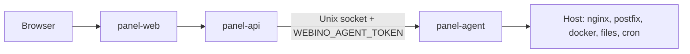

# Webino Agent Security

The `panel-agent` container is a **privileged root-level daemon** on the host. The Laravel API is the only intended caller.

## Trust boundary

- **panel-api**, **panel-scheduler**, and **panel-worker** authenticate to the agent with `WEBINO_AGENT_TOKEN`.
- The agent Unix socket is **not** published on the host network.
- Terminal WebSocket is proxied through **panel-web**; do not expose agent port `9091` publicly.

## Privileges (compose)

| Mount / flag | Purpose | Risk |
|--------------|---------|------|
| `privileged: true` | systemctl, mount, network namespaces | Full host compromise if agent is breached |
| `pid: host` | Process visibility | Host process enumeration |
| `/var/run/docker.sock` | Docker app management | Container escape / host takeover |
| `/etc/nginx`, `/etc/postfix`, `/etc/dovecot` | Service configuration | Mail/web server takeover |
| `/var/mail` | Mailbox data | Data exfiltration |

See `docker-compose.panel.yml` service `panel-agent`.

## Token lifecycle

1. **Generate** — `panel.sh` / `ensure_panel_secrets()` writes `WEBINO_AGENT_TOKEN` to `panel/backend/.env` and `panel/.env`.
2. **Deploy** — always start compose with `docker compose --env-file panel/.env -f panel/docker-compose.panel.yml up -d`.
3. **Rotate**
   - Generate new token: `openssl rand -hex 32`
   - Update `WEBINO_AGENT_TOKEN` in both env files
   - `docker compose --env-file panel/.env -f panel/docker-compose.panel.yml up -d --force-recreate panel-api panel-agent panel-scheduler panel-worker panel-phpmyadmin panel-phppgadmin panel-roundcube`
4. **Verify** — `docker compose exec panel-api php artisan tinker` → agent health via a simple domains list API call.

## Endpoint categories

| Category | Examples | Panel permission |
|----------|----------|------------------|
| Domains / DNS / SSL | `/v1/domains`, `/v1/dns/*`, `/v1/ssl/*` | `domains.manage`, `system.manage` |
| Mail / FTP / Files | `/v1/mail/*`, `/v1/ftp/*`, `/v1/files` | `system.manage` |
| Security | `/v1/security/*`, firewall, fail2ban | `security.manage` |
| Docker apps | `/v1/docker/*` | `apps.manage` |
| Backups | `/v1/backups` | `system.manage` |
| Cron | `/v1/cron` | `system.manage` (cron commands validated) |

## Hardening notes

- **Cron** — denylist blocks `curl`, `wget`, shells, `docker`, etc. (`security_validation.go`).
- **Files** — `safeFilePath` resolves symlinks before jail check (`handlers_phase23.go`).
- **Raw vhost** — disabled unless `WEBINO_ALLOW_RAW_VHOST=true`.
- **API docs** — `panel-docs` is **dev profile only** (`docker compose --profile dev`); not exposed on default install.

## Incident response

1. Revoke agent token (rotate as above).
2. Audit crontabs: `docker compose exec panel-agent crontab -l`.
3. Review recent file changes under `WEBINO_FILES_ROOT`.
4. Check Docker containers: `docker ps -a`.
5. Review panel audit log: Security → Audit.
